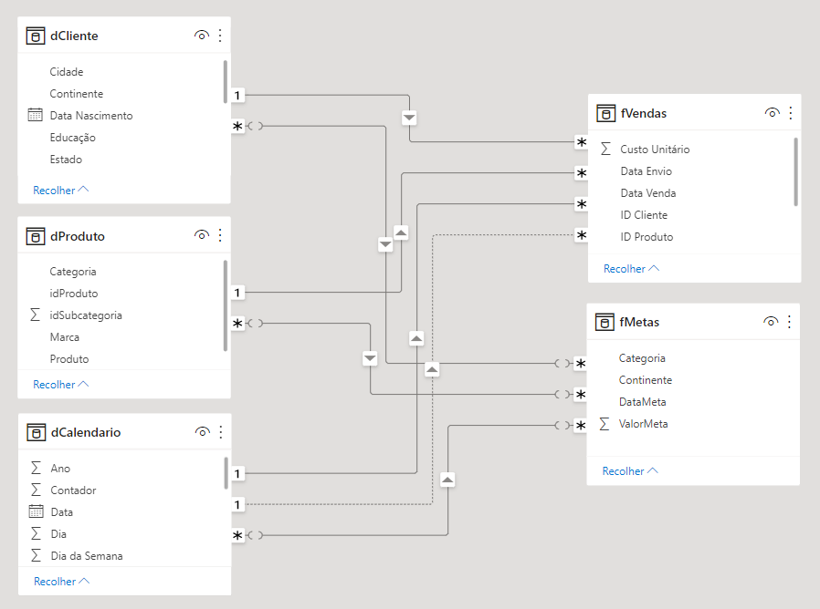

Esse é um projeto de Business Intelligence.

Os conjuntos de dados utilizados estão disponíveis no repositório "Bases".

# Entendimento do Negócio

A Master Eletronics é uma empresa americana que comercializa produtos eletrônicos de forma online para todo o mundo. Apesar de sua rápida expansão, atualmente a empresa não conta com uma equipe especializada em análise de dados. 

Visando mudar esse cenário e se tornar uma empresa data driven, fomos contratados para desenvolver um dashboard que retrate de forma descritiva o desempenho das vendas nos últimos anos. O dashboard deverá conter informações referentes as marcas e produtos mais vendidos, assim como uma análise temporal que demonstre de forma visual o comparativo anual de vendas. 

# Entendimento dos Dados

Os dados disponibilizados pela Master Eletronics são referentes ao anos de 2017, 2018 e início de 2019. Os arquivos foram extraídos de diversas fontes e por isso estão em diferentes formatos como CSV, Excel e JSON. 

- Vendas: tabela com informações históricas das vendas entre 01/01/2017 a 16/03/2019.  
- Meta 2017: metas de vendas do ano de 2017 para cada continente e categoria de produto.  
- Meta 2018 e 2019: metas de vendas do ano de 2018 e 2019 para cada continente e categoria de produto.  
- Clientes: tabela com informações cadastrais dos clientes.  
- Localizacao: tabela com informações sobre as localidades das vendas (cidades, países e continentes).  
- Produtos: tabela com informações sobre as marcas e produtos.  
- Subcategoria: informações complementares dos produtos vendidos pela empresa.  

# Estratégia da Solução

Como estratégia para a solução do projeto, definimos as seguintes etapas:

- **1. Entendimento do Negócio:** nesta etapa inicial, o principal objetivo é compreender o problema de negócio e as necessidades do cliente.

- **2. Entendimento dos Dados:** aqui, nosso objetivo é realizar a limpeza e a transformação nos dados disponibilizados pela empresa. 

- **3. Modelagem dos Dados:** essa é a etapa em que desenvolvemos o modelo de dados, definindo os relacionamentos entre as tabelas fatos e dimensões.

- **4. Desenvolvimento do Dashboard:** é aqui que iremos desenvolver todas as funcionalidades do painel, definindo juntamente ao cliente quais os principais KPI's e visuais que deverão estar destacados no painel. 

- **5. Personalização do Layout:** após a criação dos visuais, é hora de cuidar da parte visual do projeto. Utilizando uma ferramenta externa, criaremos os background's das páginas do dashboard.

- **6. Testes de Funcionalidades:** antes da entrega final do projeto ao cliente, testaremos todas as funcionalidades disponivéis no dashboard.

# Modelagem dos Dados

Durante a fase de limpeza e transformação dos dados, várias tarefas foram aplicadas utilizando o Power Query em conjunto com as linguagens DAX e M. Além dessa etapa ser fundamental para tratar possíveis inconsistências nos dados, ela também nos permitiu criar uma modelagem eficiênte através do modelo Star Schema. 

